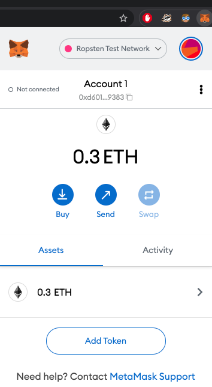
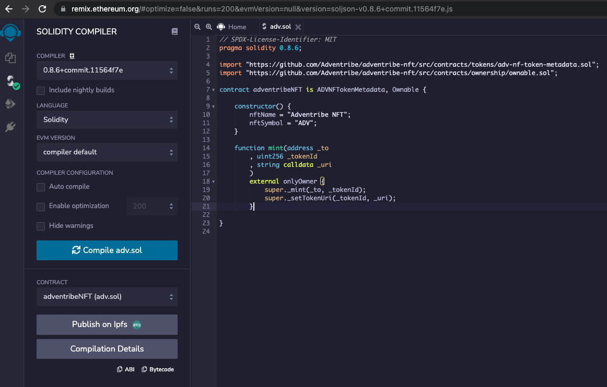
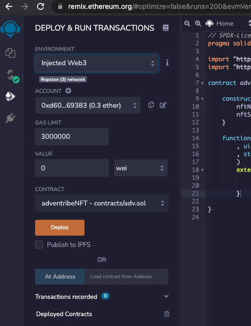

# Adventribe NFT

Implementation of [ERC 721 Non Fungible Token Standard](https://ethereum.org/en/developers/docs/standards/tokens/erc-721/) for Adventribe NF Tokens (ADV).


## Execute Locally:

Entry Contract - src/contracts/adv-nft.sol

You know what you are doing.


## Execute on [Remix IDE](https://remix.ethereum.org/):

- Step 0: Setup metamask, Ropsten Test Network & get some test ether.




- Step 1: Define Contract

```javascript
// SPDX-License-Identifier: MIT
pragma solidity 0.8.6;
 
import "https://github.com/Adventribe/adventribe-nft/src/contracts/tokens/adv-nf-token-metadata.sol";
import "https://github.com/Adventribe/adventribe-nft/src/contracts/ownership/ownable.sol";
 
contract adventribeNFT is ADVNFTokenMetadata, Ownable {

    constructor() {
        nftName = "Adventribe NFT";
        nftSymbol = "ADV";
    }

    function mint(address _to
        , uint256 _tokenId
        , string calldata _uri
        )
        external onlyOwner {
            super._mint(_to, _tokenId);
            super._setTokenUri(_tokenId, _uri);
        }

}
```
- Step 2: Compile Contract above
  


- Step 3: Deploy as _injected web3_ (set in environment)



- Step 4: Add your Ropsten Address and Transact. (the transact action may be abstracted using an API call from the Adventribe web/mobile App.)


### TODO
- [x] Base NFT Contract
- [ ] Events
- [ ] Link with PPaaS (Proof of Participation/Presence)


